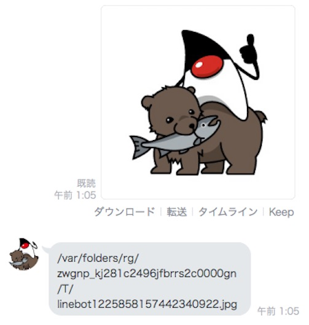

## バイナリデータを受信する

Botは、文字列のメッセージだけではなく、画像・動画・ファイル・音声といったバイナリデータをメッセージイベントとして受け取ることができる。

[公式ドキュメント：メッセージイベント](https://developers.line.me/ja/reference/messaging-api/#anchor-e2c59da01216760e81e8ca10c55b2e28b276c3e5)

ここでは、画像を題材に説明する。

### Callbackクラスを画像のメッセージイベントに対応させる

#### LineMessageClientをフィールド変数に追加する

文字列、位置情報、スタンプなど、バイナリデータが含まれないメッセージイベントと異なり、バイナリデータを含むメッセージでは `LineMessageClient` のメソッドを利用する。

このため、Callbackクラスのフィールド変数を用意し、インジェクションできるようにする。

```java
  private LineMessagingClient client;

  @Autowired
  public Callback(LineMessagingClient client) {
    this.client = client;
  }
```

#### 画像のメッセージイベント用のメソッドを作成する

画像のメッセージイベントを受け取ったら、Botがローカルにファイルを保存し、保存先のファイルパスを表示するメソッドを作成する。

*注意：あくまでハンズオンとしての動作なので、運用環境ではファイルパスを表示するようなことは避ける。*

```java
// 画像のメッセージイベントに対応する
  @EventMapping
  public Message handleImg(MessageEvent<ImageMessageContent> event) {
    // ①画像メッセージのidを取得する
    String msgId = event.getMessage().getId();
    Optional<String> opt = Optional.empty();
    try {
      // ②画像メッセージのidを使って MessageContentResponse を取得する
      MessageContentResponse resp = client.getMessageContent(msgId).get();
      log.info("get content{}:", resp);
      // ③ MessageContentResponse からファイルをローカルに保存する
      // ※LINEでは、どの解像度で写真を送っても、サーバ側でjpgファイルに変換される
      opt = makeTmpFile(resp, ".jpg");
    } catch (InterruptedException | ExecutionException e) {
      e.printStackTrace();
    }
    // ④ ファイルが保存できたことが確認できるように、ローカルのファイルパスをコールバックする
    // 運用ではファイルパスを表示することは避けましょう
    String path = opt.orElseGet(() -> "ファイル書き込みNG");
    return reply(path);
  }

  // MessageContentResponseの中のバイト入力ストリームを、拡張子を指定してファイルに書き込む。
  // また、保存先のファイルパスをOptional型で返す。
  private Optional<String> makeTmpFile(MessageContentResponse resp, String extension) {
    // tmpディレクトリに一時的に格納して、ファイルパスを返す
    try (InputStream is = resp.getStream()) {
      Path tmpFilePath = Files.createTempFile("linebot", extension);
      Files.copy(is, tmpFilePath, REPLACE_EXISTING);
      return Optional.ofNullable(tmpFilePath.toString());
    } catch (IOException e) {
      e.printStackTrace();
    }
    return Optional.empty();
  }
```

### 動作確認

1. LineBotApplication を一度停止して、再起動する
2. LINEで、Botに向かって画像を送付する
3. Botが画像の保存を表示する<br>
4. Finderやエクスプローラーから、表示されたファイルパスを確認し、同じ画像ファイルが保存されていることを確認する

### 解説と補足

- 動画・ファイル・音声についても同様に、<br>
  <ol>
    <li>メッセージIdを取得する</li>
    <li>メッセージIdから MessageContentResponse を取得する</li>
    <li>MessageContentResponse からバイト入力ストリームを取得し、利用する</li>
  </ol>という手順を踏む。
- MessageEvent の型引数として対応するクラスは以下の通り。
    - 画像： `ImageMessageContent` （必ず `jpg` ファイル）
    - 音声： `AudioMessageContent` （必ず `m4a` ファイル）
    - 動画： `VideoMessageContent` （必ず `mp4` ファイル）
    - ファイル： `FileMessageContent` （送信元のファイル名とサイズを `getFilename()` 、 `getSize()` で取得可能）

-----

[戻る](../../README.md)
